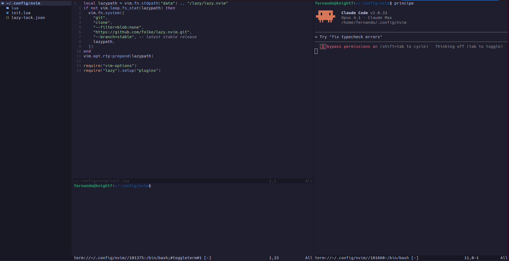

# Neovim IDE Setup - Configuração Completa

Uma configuração profissional do Neovim com layout de IDE moderno, incluindo explorador de arquivos (Neo-tree), LSP, autocompletar, Git integrado e terminais embutidos.



## 🚀 Início Rápido

```bash
# 1. Abrir arquivo
nvim seu_arquivo.py

# 2. Montar o layout IDE (pressione as teclas em sequência):
,           # Abre terminal inferior
Space + e   # Abre Neo-tree à esquerda
;           # Abre terminal Claude Code à direita
```

> **💡 Lembre-se:** `<leader>` = `Espaço` (Space)

## Índice

- [Instalação](#instalação)
  - [Ubuntu/Debian](#ubuntudebian)
  - [macOS](#macos)
- [Estrutura de Arquivos](#estrutura-de-arquivos)
- [Layout IDE](#layout-ide)
- [Comandos e Atalhos](#comandos-e-atalhos)
  - [Atalhos Essenciais](#atalhos-essenciais)
  - [Navegação no Vim](#navegação-no-vim)
  - [Edição Avançada](#edição-avançada)
  - [Telescope (Busca Fuzzy)](#telescope-busca-fuzzy)
  - [Neo-tree (Explorador de Arquivos)](#neo-tree-explorador-de-arquivos)
  - [LSP (Language Server Protocol)](#lsp-language-server-protocol)
  - [Git (Fugitive e Gitsigns)](#git-fugitive-e-gitsigns)
  - [Terminais](#terminais)
- [Marcos (Marks)](#marcos-marks)
- [Modo Visual](#modo-visual)
- [Edição em Múltiplas Linhas](#edição-em-múltiplas-linhas)
- [Troubleshooting](#troubleshooting)

---

## Instalação

### Ubuntu/Debian

```bash
# 1. Instalar Neovim (versão mais recente)
sudo add-apt-repository ppa:neovim-ppa/unstable
sudo apt update
sudo apt install neovim

# 2. Instalar dependências essenciais
sudo apt install -y \
  git \
  curl \
  wget \
  ripgrep \
  fd-find \
  xclip \
  python3 \
  python3-pip \
  nodejs \
  npm \
  gcc \
  g++ \
  make

# 3. Criar link simbólico para fd (se necessário)
sudo ln -s $(which fdfind) /usr/local/bin/fd

# 4. Instalar Nerd Font (para ícones)
mkdir -p ~/.local/share/fonts
cd ~/.local/share/fonts
wget https://github.com/ryanoasis/nerd-fonts/releases/download/v3.1.1/JetBrainsMono.zip
unzip JetBrainsMono.zip
rm JetBrainsMono.zip
fc-cache -fv

# 5. Clonar esta configuração
git clone <seu-repo-url> ~/.config/nvim

# 6. Abrir o Neovim (plugins serão instalados automaticamente)
nvim
```

### macOS

```bash
# 1. Instalar Homebrew (se ainda não tiver)
/bin/bash -c "$(curl -fsSL https://raw.githubusercontent.com/Homebrew/install/HEAD/install.sh)"

# 2. Instalar Neovim e dependências
brew install neovim
brew install git curl wget ripgrep fd node python3 gcc

# 3. Instalar Nerd Font
brew tap homebrew/cask-fonts
brew install --cask font-jetbrains-mono-nerd-font

# 4. Clonar esta configuração
git clone <seu-repo-url> ~/.config/nvim

# 5. Abrir o Neovim (plugins serão instalados automaticamente)
nvim
```

---

## Estrutura de Arquivos

```
~/.config/nvim/
├── init.lua                    # Arquivo principal
├── lua/
│   ├── vim-options.lua         # Configurações gerais do Vim
│   └── plugins/
│       ├── neo-tree.lua        # Explorador de arquivos
│       ├── telescope.lua       # Busca fuzzy
│       ├── lsp-config.lua      # Language Server Protocol
│       ├── completions.lua     # Autocompletar
│       ├── treesitter.lua      # Syntax highlighting
│       ├── git-stuff.lua       # Git integrado
│       ├── toggleterm.lua      # Terminal embutido
│       └── ...
└── README.md                   # Este arquivo
```

---

## Layout IDE

Layout recomendado para trabalhar como uma IDE completa:

```
┌─────────────┬──────────────────────────────┬──────────────────┐
│             │                              │                  │
│  Neo-tree   │      Editor Principal        │  Claude Code     │
│  (esquerda) │        (centro)              │  Terminal        │
│             │                              │  (direita)       │
│             │                              │                  │
│             ├──────────────────────────────┤                  │
│             │  Terminal Geral (inferior)   │                  │
└─────────────┴──────────────────────────────┴──────────────────┘
```

### Como Configurar o Layout

Siga estes passos para montar o layout IDE:

```bash
# 1. Abrir um arquivo com Neovim
nvim meu_arquivo.py

# 2. Dentro do Neovim:
# Pressione: , (vírgula) - abre terminal inferior
# Pressione: Space + e (leader + e) - abre Neo-tree à esquerda
# Pressione: ; (ponto-e-vírgula) - abre terminal Claude Code à direita
```

> **Nota Importante:** `<leader>` está configurado como a tecla `Espaço` (Space)

### Descrição dos Painéis

- **Neo-tree (esquerda)**: Explorador de arquivos - `Space + e`
- **Editor (centro)**: Seu código principal
- **Terminal Claude Code (direita)**: Terminal dedicado para Claude Code - `;`
- **Terminal Geral (inferior)**: Terminal para comandos gerais - `,`

---

## Comandos e Atalhos

> **🔑 IMPORTANTE:** `<leader>` está configurado como a tecla `Espaço` (Space)
>
> Sempre que você ver `<leader>` nos atalhos abaixo, significa que você deve pressionar a tecla `Espaço` primeiro.
>
> **Exemplos:**
> - `<leader>e` = `Espaço` + `e`
> - `<leader>fg` = `Espaço` + `f` + `g`
> - `<leader>gd` = `Espaço` + `g` + `d`

### Atalhos Essenciais

| Atalho | Modo | Descrição |
|--------|------|-----------|
| `<leader>h` | Normal | Remover highlight de busca |
| `<Esc><Esc>` | Terminal | Sair do modo terminal |
| `<C-w>` | Terminal | Navegação de janelas no terminal |

---

## Navegação no Vim

### Movimentação Básica

| Tecla | Descrição |
|-------|-----------|
| `h` | Esquerda |
| `j` | Baixo |
| `k` | Cima |
| `l` | Direita |
| `w` | Próxima palavra |
| `b` | Palavra anterior |
| `e` | Final da palavra |
| `0` | Início da linha |
| `^` | Primeiro caractere não-branco da linha |
| `$` | Final da linha |
| `gg` | Início do arquivo |
| `G` | Final do arquivo |

### Navegação com Números Relativos

Esta configuração usa **números relativos** (`relativenumber`), facilitando pulos precisos:

```
3   │ linha acima
2   │ linha acima
1   │ linha acima
15  │ linha atual (número absoluto)
1   │ linha abaixo
2   │ linha abaixo
3   │ linha abaixo
```

**Exemplos:**

- `5j` - Desce 5 linhas
- `3k` - Sobe 3 linhas
- `10j` - Pula 10 linhas para baixo

### Navegação Avançada

| Comando | Descrição |
|---------|-----------|
| `{` | Parágrafo anterior |
| `}` | Próximo parágrafo |
| `Ctrl-u` | Subir meia página |
| `Ctrl-d` | Descer meia página |
| `Ctrl-b` | Subir página inteira |
| `Ctrl-f` | Descer página inteira |
| `H` | Topo da tela |
| `M` | Meio da tela |
| `L` | Base da tela |
| `:<número>` | Ir para linha específica (ex: `:42`) |

### Navegação entre Janelas

| Atalho | Descrição |
|--------|-----------|
| `Ctrl-h` | Janela esquerda |
| `Ctrl-j` | Janela inferior |
| `Ctrl-k` | Janela superior |
| `Ctrl-l` | Janela direita |

### Redimensionar Janelas

| Atalho | Descrição |
|--------|-----------|
| `Ctrl-Up` | Aumentar altura |
| `Ctrl-Down` | Diminuir altura |
| `Ctrl-Left` | Diminuir largura |
| `Ctrl-Right` | Aumentar largura |
| `<leader>tm` | Toggle tamanho do terminal |

---

## Edição Avançada

### Deletar

| Comando | Descrição |
|---------|-----------|
| `dd` | Deletar linha inteira |
| `3dd` | Deletar 3 linhas |
| `d$` | Deletar até o final da linha |
| `d0` | Deletar até o início da linha |
| `dw` | Deletar palavra |
| `diw` | Deletar palavra sob o cursor |
| `di"` | Deletar dentro de aspas |
| `di(` | Deletar dentro de parênteses |
| `dt<char>` | Deletar até o caractere |
| `df<char>` | Deletar até e incluindo o caractere |
| `dG` | Deletar até o final do arquivo |
| `dgg` | Deletar até o início do arquivo |

### Copiar (Yank)

| Comando | Descrição |
|---------|-----------|
| `yy` | Copiar linha |
| `3yy` | Copiar 3 linhas |
| `y$` | Copiar até o final da linha |
| `yw` | Copiar palavra |
| `yiw` | Copiar palavra sob o cursor |
| `yi"` | Copiar dentro de aspas |
| `yG` | Copiar até o final do arquivo |

### Colar

| Comando | Descrição |
|---------|-----------|
| `p` | Colar após o cursor |
| `P` | Colar antes do cursor |
| `]p` | Colar e ajustar indentação |

> **Nota:** Esta configuração usa `clipboard=unnamedplus`, então copiar/colar funciona com o clipboard do sistema!

### Desfazer/Refazer

| Comando | Descrição |
|---------|-----------|
| `u` | Desfazer |
| `Ctrl-r` | Refazer |
| `U` | Desfazer todas as mudanças na linha |

### Buscar no Arquivo

| Comando | Descrição |
|---------|-----------|
| `/texto` | Buscar "texto" para frente |
| `?texto` | Buscar "texto" para trás |
| `n` | Próxima ocorrência |
| `N` | Ocorrência anterior |
| `*` | Buscar palavra sob o cursor (para frente) |
| `#` | Buscar palavra sob o cursor (para trás) |
| `<leader>h` | Remover highlight da busca |

### Substituir

| Comando | Descrição |
|---------|-----------|
| `:%s/old/new/g` | Substituir todas as ocorrências |
| `:%s/old/new/gc` | Substituir com confirmação |
| `:s/old/new/g` | Substituir na linha atual |
| `:'<,'>s/old/new/g` | Substituir na seleção visual |

---

## Telescope (Busca Fuzzy)

| Atalho | Descrição |
|--------|-----------|
| `Ctrl-p` | Buscar arquivos |
| `<leader>fg` | Buscar texto em todos os arquivos (live grep) |
| `<leader><leader>` | Arquivos recentes |
| `<leader>fw` | Buscar palavra sob o cursor |

### Dentro do Telescope

| Tecla | Descrição |
|-------|-----------|
| `Ctrl-j/k` | Navegar para baixo/cima |
| `Enter` | Abrir arquivo |
| `Ctrl-x` | Abrir em split horizontal |
| `Ctrl-v` | Abrir em split vertical |
| `Ctrl-t` | Abrir em nova tab |
| `Esc` | Fechar |

---

## Neo-tree (Explorador de Arquivos)

| Atalho | Descrição |
|--------|-----------|
| `Ctrl-n` | Abrir/revelar Neo-tree |
| `<leader>e` | Toggle Neo-tree |
| `<leader>bf` | Buffers flutuante |

### Dentro do Neo-tree

| Tecla | Descrição |
|-------|-----------|
| `Enter` | Abrir arquivo/pasta |
| `a` | Criar novo arquivo/pasta |
| `d` | Deletar |
| `r` | Renomear |
| `c` | Copiar |
| `x` | Recortar |
| `p` | Colar |
| `y` | Copiar nome do arquivo |
| `Y` | Copiar caminho relativo |
| `gy` | Copiar caminho absoluto |
| `H` | Toggle arquivos ocultos |
| `.` | Toggle arquivos dotfiles |
| `R` | Atualizar |
| `?` | Mostrar ajuda |

---

## LSP (Language Server Protocol)

### Atalhos LSP

| Atalho | Descrição |
|--------|-----------|
| `K` | Mostrar documentação (hover) |
| `gd` | Ir para definição |
| `gD` | Ir para declaração |
| `gI` | Ir para implementação |
| `gr` | Mostrar referências |
| `<leader>gd` | Ir para definição |
| `<leader>gi` | Ir para implementação |
| `<leader>gr` | Mostrar referências |
| `<leader>ca` | Ações de código |
| `<leader>rn` | Renomear símbolo |
| `[d` | Diagnóstico anterior |
| `]d` | Próximo diagnóstico |
| `Ctrl+LeftMouse` | Ir para definição (como VS Code) |
| `Ctrl+RightMouse` | Mostrar referências |

### Navegação de Jumps (Voltar/Avançar)

Após usar `gd`, `gr` ou outros comandos de navegação LSP, você pode voltar/avançar no histórico de posições:

| Atalho | Descrição |
|--------|-----------|
| `Ctrl+o` | Voltar para posição anterior (older) |
| `Ctrl+i` ou `Tab` | Avançar para posição seguinte (newer) |
| `:jumps` | Listar histórico completo de jumps |

### Language Servers Instalados

- **Python**: `pyright` (FastAPI, Django)
- **HTML**: `html` (templates)
- **Lua**: `lua_ls` (config do Neovim)
- **TypeScript/JavaScript**: `ts_ls`

---

## Git (Fugitive e Gitsigns)

### Comandos Git (Fugitive)

| Comando | Descrição |
|---------|-----------|
| `:Git` ou `:G` | Status do Git |
| `:Git add %` | Add arquivo atual |
| `:Git add .` | Add todos os arquivos |
| `:Git commit` | Commit |
| `:Git commit -m "msg"` | Commit com mensagem |
| `:Git push` | Push |
| `:Git pull` | Pull |
| `:Git diff` | Diff |
| `:Git log` | Log |
| `:Git blame` | Blame |
| `:Git branch` | Listar branches |
| `:Git checkout <branch>` | Trocar branch |
| `:Git checkout -b <branch>` | Criar e trocar branch |
| `:Git merge <branch>` | Merge |
| `:Git rebase <branch>` | Rebase |
| `:Git stash` | Stash |
| `:Git stash pop` | Pop stash |

### Dentro do `:Git` Status

| Tecla | Descrição |
|-------|-----------|
| `s` | Stage arquivo sob o cursor |
| `u` | Unstage arquivo |
| `-` | Stage/Unstage |
| `=` | Toggle diff |
| `cc` | Commit |
| `ca` | Commit --amend |
| `dd` | Ver diff |

### Gitsigns (Indicadores no Editor)

| Atalho | Descrição |
|--------|-----------|
| `<leader>gp` | Preview hunk |
| `<leader>gt` | Toggle blame da linha |

---

## Terminais

### Terminal Horizontal (Geral)

```
,    (vírgula)
```

Abre/fecha terminal horizontal na parte inferior (15 linhas).

### Terminal Vertical (Claude Code)

```
;    (ponto-e-vírgula)
```

Abre/fecha terminal vertical à direita (80 colunas). Ideal para Claude Code.

### Dentro do Terminal

| Atalho | Descrição |
|--------|-----------|
| `<Esc><Esc>` | Sair do modo terminal para modo normal |
| `<C-w>` | Navegação entre janelas |
| `<leader>tm` | Toggle tamanho do terminal |

---

## Marcos (Marks)

Marcos permitem salvar posições no arquivo e retornar rapidamente.

### Criar Marco

```
m<letra>    (ex: ma, mb, mc)
```

- **Minúsculas** (`ma-mz`): Marcos locais ao arquivo
- **Maiúsculas** (`mA-mZ`): Marcos globais (entre arquivos)

### Ir para Marco

| Comando | Descrição |
|---------|-----------|
| `'a` | Ir para linha do marco `a` |
| `` `a `` | Ir para posição exata do marco `a` |
| `''` | Voltar para posição anterior ao último pulo |
| `` `` `` | Voltar para posição exata anterior |

### Listar Marcos

```
:marks
```

### Deletar Marcos

```
:delmarks a b c    (deleta marcos a, b, c)
:delmarks!         (deleta todos os marcos locais)
```

### Exemplo de Uso

```vim
" 1. Você está editando linha 50
ma              " Marca posição como 'a'

" 2. Você navega para linha 200 e edita

" 3. Voltar rapidamente
'a              " Volta para linha do marco 'a'
```

---

## Modo Visual

### Entrar no Modo Visual

| Comando | Descrição |
|---------|-----------|
| `v` | Modo visual (caractere) |
| `V` | Modo visual (linha) |
| `Ctrl-v` | Modo visual (bloco) |

### No Modo Visual

| Comando | Descrição |
|---------|-----------|
| `d` | Deletar seleção |
| `y` | Copiar seleção |
| `c` | Deletar e entrar no modo insert |
| `>` | Indentar para direita |
| `<` | Indentar para esquerda |
| `=` | Auto-indentar |
| `u` | Converter para minúsculas |
| `U` | Converter para maiúsculas |
| `~` | Inverter case |

---

## Edição em Múltiplas Linhas

### Método 1: Modo Visual Bloco (Ctrl-v)

**Exemplo: Adicionar `// ` no início de múltiplas linhas**

```vim
1. Posicione o cursor no início da primeira linha
2. Ctrl-v          " Entrar no modo visual bloco
3. jjj             " Descer 3 linhas (seleciona coluna)
4. I               " Entrar no modo insert
5. // <Esc>        " Digitar e pressionar Esc
```

**Exemplo: Deletar primeiros 3 caracteres de múltiplas linhas**

```vim
1. Ctrl-v
2. jjjj            " Seleciona 4 linhas
3. lll             " Seleciona 3 colunas
4. d               " Deleta
```

### Método 2: Modo Visual de Linha (V)

```vim
1. V               " Modo visual de linha
2. jjj             " Seleciona 3 linhas
3. :s/^/# /        " Adiciona '# ' no início
```

### Método 3: Substituição com Range

```vim
:5,10s/^/# /       " Adiciona '# ' nas linhas 5-10
:'<,'>s/^/# /      " Adiciona '# ' na seleção visual
:%s/^/# /          " Adiciona '# ' em todo o arquivo
```

### Método 4: Macro + Modo Visual

```vim
1. qa              " Começar a gravar macro 'a'
2. I# <Esc>j       " Adicionar '# ' e descer
3. q               " Parar gravação
4. V               " Modo visual de linha
5. jjj             " Seleciona linhas
6. :normal @a      " Aplica macro em cada linha
```

---

## Troubleshooting

### Plugins não instalaram

```bash
nvim
:Lazy sync
```

### LSP não funciona

```bash
nvim
:Mason
# Instale os servidores manualmente (i para instalar)
```

### Ícones não aparecem

Certifique-se de ter uma **Nerd Font** instalada e configurada no seu terminal.

### Como abrir o Neo-tree

O Neo-tree não abre automaticamente. Para abri-lo, use:

```
Space + e    (ou <leader>e)
```

### Clipboard não funciona

**Ubuntu:**

```bash
sudo apt install xclip
```

**macOS:**

```bash
# Já funciona nativamente
```

---

## Plugins Incluídos

- **lazy.nvim**: Gerenciador de plugins
- **neo-tree**: Explorador de arquivos
- **telescope**: Busca fuzzy
- **treesitter**: Syntax highlighting
- **LSP**: Autocomplete e análise de código
- **mason**: Gerenciador de LSP servers
- **nvim-cmp**: Autocompletar
- **gitsigns**: Indicadores Git
- **vim-fugitive**: Comandos Git
- **toggleterm**: Terminal embutido
- **catppuccin**: Tema

---

## Créditos

Esta configuração é baseada no excelente trabalho de [cpow/neovim-for-newbs](https://github.com/cpow/neovim-for-newbs), com customizações e melhorias adicionadas para:

- Layout IDE automático com múltiplos terminais
- Integração otimizada com **Claude Code**
- Configurações específicas para desenvolvimento profissional em Python (FastAPI/Django), TypeScript e Lua
- Atalhos e workflows personalizados

### Agradecimentos

- **[@cpow](https://github.com/cpow)** - Pela configuração base incrível do Neovim
- Comunidade Neovim - Por todos os plugins e ferramentas fantásticas

## Licença

MIT License - Sinta-se livre para usar e modificar!
